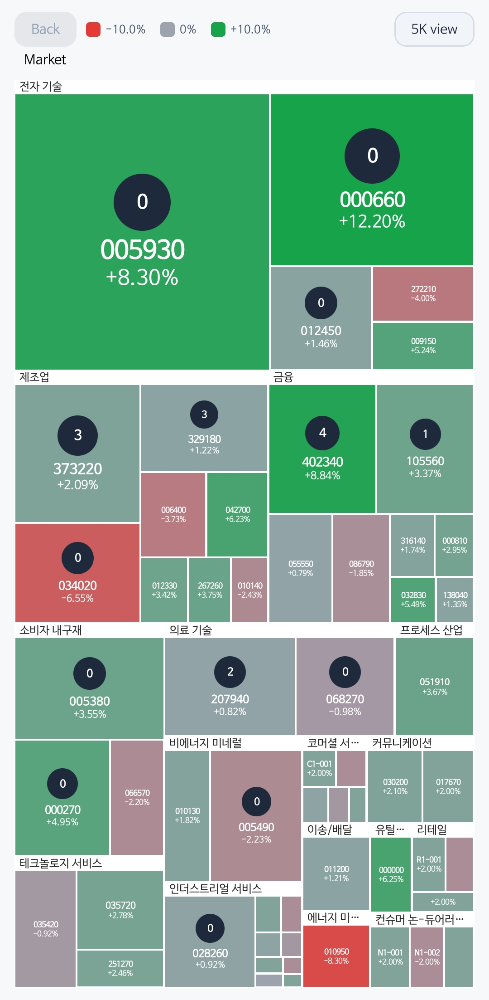
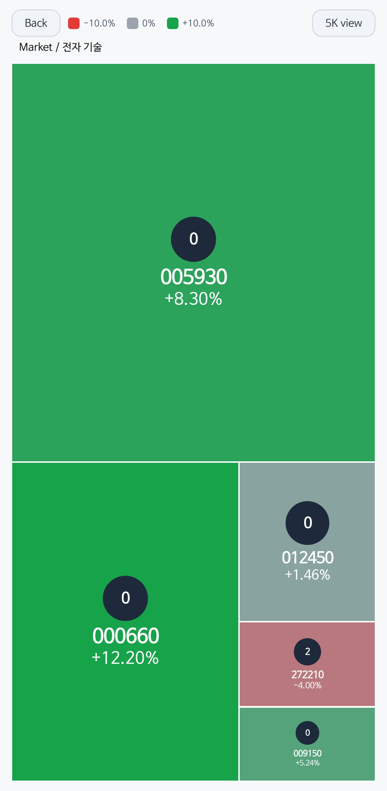
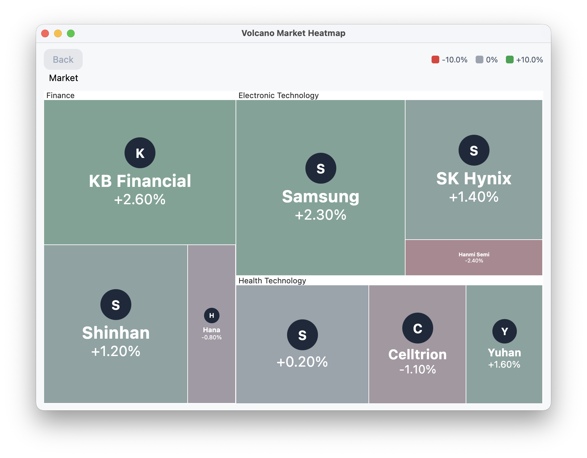
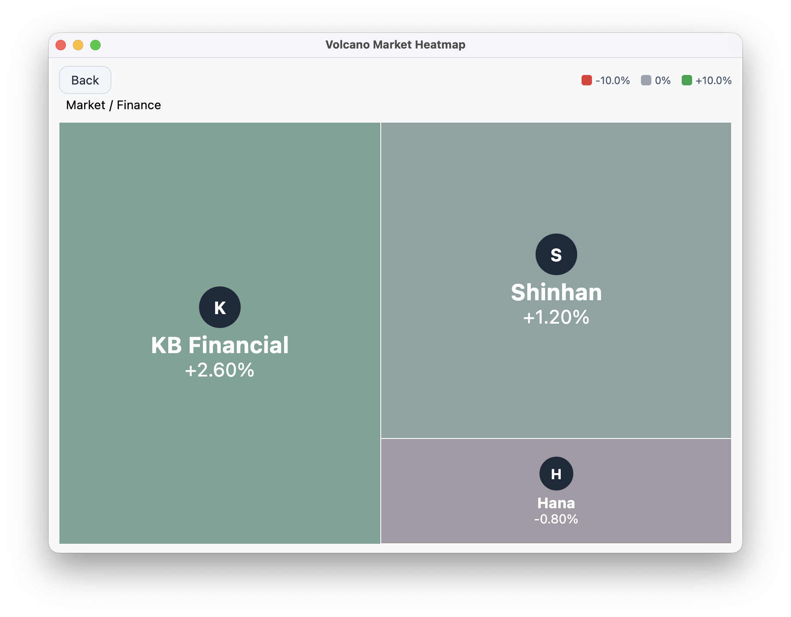
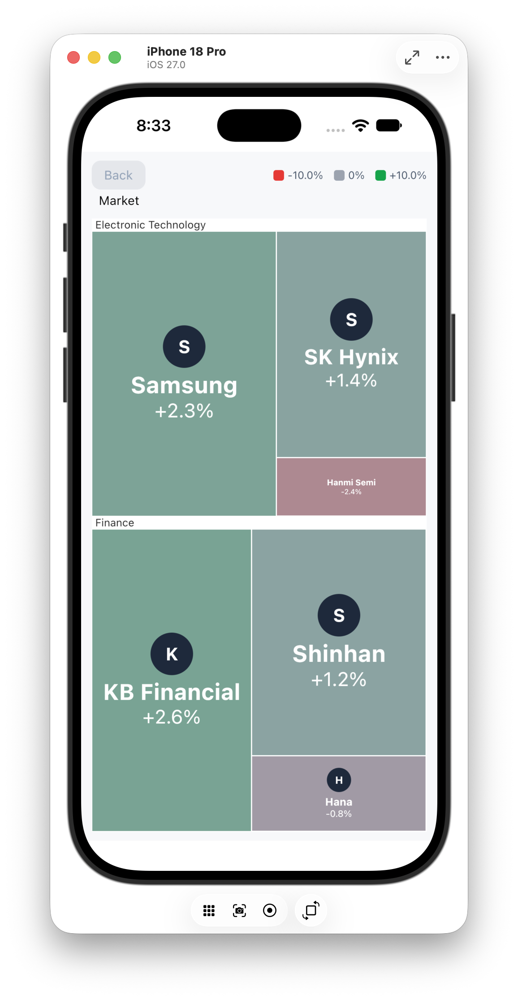
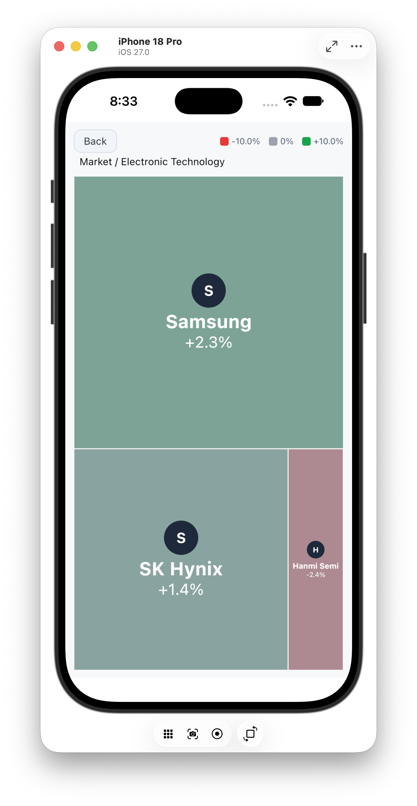

import { GalleryGrid } from "@/components/gallery-grid";

## 포함된 애플리케이션

| 샘플 | 검증하는 항목 |
| --- | --- |
| `androidApp` | edge-to-edge 호스트 레이아웃, 시스템 뒤로 가기 drill-up, 리프 선택 |
| `iosApp` | Compose `UIViewController` 브리지, safe area 호스트, iOS Simulator 프레임워크 |
| `desktopApp` | 크기 조절 창, hover tooltip, 포인터 상호작용 |
| `examples/react-demo` | React SVG 통합, 빠른 피드, drill-down, 집계/원본 5,000리프 모드 |
| `benchmark` | 5,000개 리프의 합성 트리를 통한 공통 레이아웃 측정 |

이 애플리케이션들은 라이브러리의 런타임 의존성이 아니라, 통합 동작을 검증하기 위한 데모입니다.

## Android: 전체 보기와 drill-down

아래 캡처는 Android 데모에 포함된 금융 fixture로 Galaxy S25(`SM-S938N`)에서 검증했습니다. 전체 화면은 섹션과 범례를 함께 보여 주고, `전자 기술` 그룹 헤더를 선택하면 breadcrumb와 뒤로 가기 제어가 있는 리프 수준 히트맵으로 이동합니다.

<GalleryGrid>





</GalleryGrid>

## Desktop: 크기 조절 전체 보기와 drill-down

Desktop 샘플은 크기 조절이 가능한 Compose Desktop 창에서 동일한 공유 `Heatmap` API를 사용합니다. 전체 보기는 형제 그룹을 한 번에 보여 주며, 금융 drill-down에서도 breadcrumb와 뒤로 가기 제어를 유지합니다. 포인터 hover는 별도의 Desktop 상호작용 정책으로 사용할 수 있습니다.

<GalleryGrid>





</GalleryGrid>

## iOS: safe area 전체 보기와 drill-down

iOS Simulator 호스트는 동일한 공유 Compose UI를 `UIViewController`에 포함합니다. 전체 보기는 iPhone safe area를 따르며, 전자 기술 drill-down은 breadcrumb와 다른 호스트와 동일한 뒤로 가기 동작을 제공합니다.

<GalleryGrid>





</GalleryGrid>

## 캡처 정책

스크린샷이나 짧은 GIF는 손으로 만든 목업이 아니라 검증된 릴리스 후보에서 생성해야 합니다. 각 캡처에는 플랫폼, 라이브러리 버전, 기기·창 크기, 데이터셋 규모, 표시된 상호작용을 식별할 수 있는 정보가 필요합니다. 권장 흐름은 전체 보기에서 그룹 drill-down, breadcrumb·뒤로 가기 복귀, 리프 상세 선택, Desktop hover tooltip입니다.

Android, Desktop, iOS 캡처 자산은 `documentation/content/gallery/`에 커밋되어 있습니다.

## React 웹 데모

[React 데모](https://github.com/taewooyo/volcano/tree/main/examples/react-demo)는 Desktop/iOS 샘플과 같은 시장 fixture와 갱신 수식을 사용합니다. 로컬 Kotlin/JS 코어와 npm 패키지를 빌드한 뒤 Vite를 시작합니다.

```bash
./gradlew :volcano:jsDevelopmentLibraryCompileSync
cd packages/volcano-react && npm ci && npm run build
cd ../../examples/react-demo && npm ci && npm run dev
```

**Fast feed**는 100ms 지표 갱신, **5K view**와 **5K raw**는 집계/전체 5,000리프 시나리오입니다. 수동 스트레스 데모이며 브라우저 프레임률 결과는 릴리스 벤치마크로 확립되지 않았습니다. React 스크린샷은 아직 갤러리에 포함하지 않았습니다.
